## Project 3, W205 Fundamentals of Data Engineering ##
## Tutor, Vinicio DeSola ##
## Indrani Bose and Ciarán O'Connor
### Understanding User Behavior: ###
####  In this activity we will be demonstrating the use of the following tools to create a full streaming data pipeline.
#### 1) Python Flask App with HTML GUI and SQLAlchemy, GET and POST requests ####
#### 2) Apache Bench ####
#### 3) Command-line User Interface and Flask App ####
#### 4) Zookeeper ####
#### 5) Kafka and Kafkacat ####
#### 6) PySpark ####
#### 7) Cloudera Hadoop HDFS ####
#### 8) HIVE ####
#### 9) Presto and SQL interrogation of pipeline delivered tables ####

## THE GAME  ##

In this activity we created several user interfaces and approaches to create **pilot** accounts for an online **space game**.  The users select a unique pilot name, an alliance they choose to join, as well as selecting a ship from their faction that they wish to fly.  We have two interactive user interfaces which we use to create the _messages_ demanded by the exercise.  These interfaces send the messages into a fully streaming pipeline all the way to **cloudera hadoop** storage in **parquet** **snappy** compressed files, which are non-persistent.  We use **hive** in a batch manner to create temporary tables from the storage, so that we can query interactively with the **presto** software.  The **SQL** queries in **presto** provide us with some business intelligence to suggest future game dynamics, software development and spend decisions for the space game.

## Front-end message generation ##

In this project we must build a complete data pipeline front-to-back.

This will be involve generating "messages" from a front-end application, which can be done in a number of ways.    
A few examples of how this could be done are listed here:  

  [1] A web interface for user interaction using **Flask**, **HTML** and **SQLAlchemy**.    
  [2] Using **Apache Bench**.    
  [3] Using a command-line user interface, with a persistent database, which can be added to and modified, then used to dispatch **requests** to the **Flask** server.     

### Flask , SQLAlchmey 
Our browser makes a request from the webserver for a page. The webserver then runs the necessary **Python** code and interacts with the database. The database sends back any requested data, and that data is then worked into an **HTML** template that is sent to the client.    
The Database stores all the site content.    
The Client displays content returned from the webserver.    

### The SQLAlchmey Schema
The schema stores information relating to pilots input data. The fields stored are listed here:

[1] pilotID = db.Column(db.Integer, primary_key=True)    
[2] pilot = db.Column(db.String(100))    
[3] allegiance = db.Column(db.String(100))    
[4] ship = db.Column(db.String(100))    
[5] ship_cost = db.Column(db.String(100))    
[6] time = db.Column(db.String(100))    

### The api end points
Exposed enpoints. 

#### Insertion of records
This endpoint is used to add a new pilot and generates a unique id for every entry.

@app.route('/insert', methods=['POST'])

#### Retrival of Records
This endpoint fetches all records present in the database.

@app.route("/")

This process requires significant alteration to the **Flask** software code to include the interaction with the web interface, which includes **SQLAlchemy** and the onward messaging to **kafka**.  The code is detailed here.  All the files that relate to this method of generating our _messages_ (namely the pilot details in this project) are stored in the _/GUI_approach_ directory provided in the **Git** commit.

```python
#!/usr/bin/env python
import os
from flask import Flask, render_template, request, redirect, url_for
from flask_sqlalchemy import SQLAlchemy
import datetime
from kafka import KafkaProducer
import json

producer = KafkaProducer(bootstrap_servers='kafka:29092')
print(dir(datetime))
transaction_time = datetime.datetime.utcnow()

project_dir = os.path.dirname(os.path.abspath(__file__))
database_file = "sqlite:///{}".format(os.path.join(project_dir, "pilotData.db"))

app = Flask(__name__)
app.config["SQLALCHEMY_DATABASE_URI"] = database_file

db = SQLAlchemy(app)

class Data(db.Model):
    pilotID = db.Column(db.Integer, primary_key=True)
    pilot = db.Column(db.String(100))
    allegiance = db.Column(db.String(100))
    ship = db.Column(db.String(100))
    ship_cost = db.Column(db.String(100))
    time = db.Column(db.String(100))

    def __init__(self, pilot, allegiance,ship,ship_cost,time):
        self.pilot = pilot
        self.allegiance = allegiance
        self.ship = ship
        self.ship_cost = ship_cost
        self.time = time

def log_to_kafka(topic, event):
    event.update(request.headers)
    producer.send(topic, json.dumps(event).encode())

# this route is for inserting data to mysql database via html forms
@app.route('/insert', methods=['POST'])
def insert():
    if request.method == 'POST':
        pilot = request.form['pilot']
        allegiance = request.form['allegiance']
        ship = request.form['ship']
        ship_cost = request.form['ship_cost']
        time = transaction_time
        my_data = Data(pilot, allegiance, ship,ship_cost,time)
        db.session.add(my_data)
        db.session.commit()
        id= len(Data.query.all())
        print("id :: ",id)

        enrol_pilot_event = {
            'event_type': 'USER_data',
            "pilotID": id,
            "pilot": pilot,
            "allegiance": allegiance,
            "ship": ship,
            "ship_cost": ship_cost,
            "datestamp": time
        }
        log_to_kafka('starfighter', enrol_pilot_event)
        return redirect(url_for('home'))

@app.route("/")
def home():
    pilots = Data.query.all()
    print("len(pilots)::",len(pilots))
    #Log to Kafka
    default_event = {'event_type': 'default'}
    log_to_kafka('starfighter', default_event)

    return render_template("index.html",pilots=pilots)

if __name__ == "__main__":
    app.run(debug=True)
```

Here we see some of the graphics of the simplisitic interface to let user input their new pilot name, allegiance choice and ship type.  This is stored in a persistent database on disk called **pilotData.db**.  The web GUI interacts with the **Flask** to convey the pilot information on and into the data pipelilne.

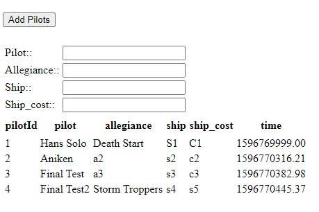

This is what the GUI looks inside the **Google Cloud AI platform** with the **Flask-SQLAlchemy** applications interacting with the HTML through a **lynx** web-browser, which is a text based browser appropriate for the **GCP AI platform**.    
Below we show the GUI woking in a text based web browser, namely **lynx**, so that the users can even use a web interface even on the **Google Cloud AI platform**.  We had to install **Flask-SQLAlchemy** inside the docker container to enable the modified flask to work in concert with the rest of the software pipeline therein.

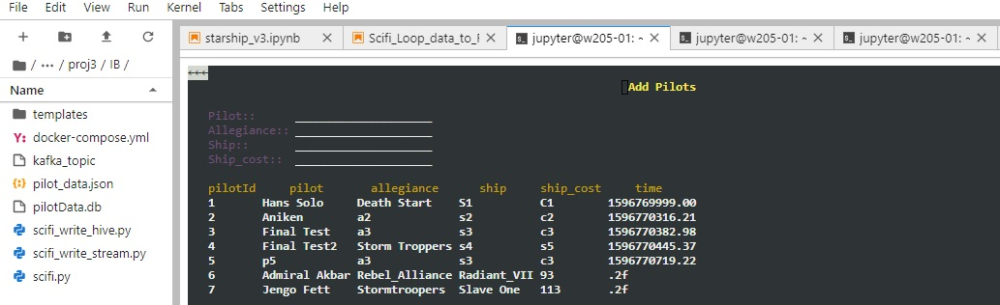

## Apache Bench for Producing Messages into the Pipeline ##

If we were to use **Apache Bench** to generate the messages then could use a command as follows to loop and generate messages until we exited the at **_Ctrl-C_**.  **Apache Bench** is a single-threaded command line computer program whcih performs rudimentary benchmarking of a Hyper Text transfer Protocol (HTTP) based server.   **Apache Bench** is capable of providing good insight into how your web service is performing.  The following command uses a while loop to issue 10 default requests to port 5000 on the localhost.  These will be be related to the flash and queued as messages to kafka. This is rather a rudimentary way of performing this action. 

```bash
while true; 
do docker-compose -f ./docker-compose.yml exec mids ab -n 10 -H "Host: user1.comcast.com" http://localhost:5000/; 
sleep 10; 
done
```

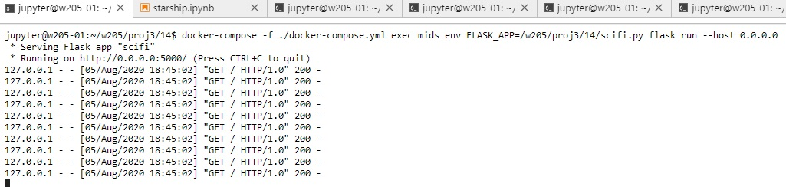

## A Python-based Interactive Command-Line Interface for Message Creation ##

Instead of a GUI, or **Apache Bench** approach, we additionally created a very capable set of **Python** scripts to produce the messages for the pipeline based upon direct user inputs, as if they were joining the game for the first time OR logging back in to play the game.    
This approach proved an excellent way to establish a persistent **JSON** database which can be added to.  Unique individual pilot accounts are created and persist.  The script checks if a pilot of the same name has been created before, insisting upon no duplication.  Each pilot has a unique number, which is the **primary key** of the database.    
The scripts and **JSON** database developed for the game are provided in the _CLI_Approach_ directory in the **Git** commit.  Necessarily this required a different flask set-up from the GUI interface approach.   
The user inputs are boxed in Green.  The user is given the opportunity to put in any pilot name they wish and this is checked against the persistent database, **pilot_data.json**, to make sure it is unique before proceeding.  The user is then given the option of choosing which alliance they wish to join, from a displayed list.  The user is then provided with a list of ships belonging to that alliance to choose from, for their own.  Once done all that information is _appended_ to the **JSON** persistent database.  Additionally the information related to a new pilot or existing pilot can be sent on into the pipeline immediately at this point.  Also included in the documentation is a _looping_ script which can send all the pilot accounts in the persistent **pilot_data.json** database to the **Flask** as a blob of messages.  This process is very efficent and is quite capable for this project.

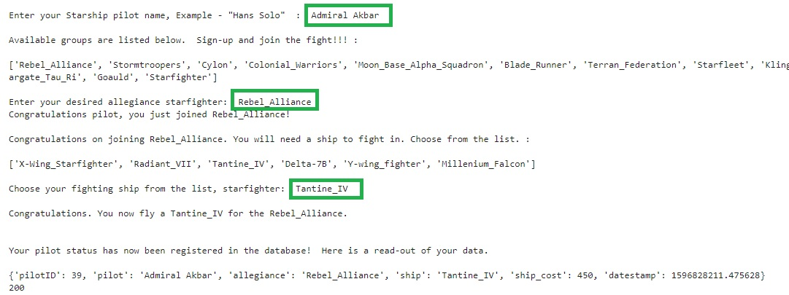

## Creating the Pipeline, Starting with Spinning-up Docker ##

First we must spin-up a **docker-compose** cluster.  This is a cluster of **docker** containers.      
These are containers for the **zookeeper**, **kafka**, **cloudera**, **spark**, mids and **presto** services.    
This is done with the use of the following **docker-compose** YAML/YML file. Stored in docker-compose.yml.
**Kafka** works in two ways.  It publishes messages to queues and it consumes/extracts messages from queues.
**Kafka** always comes with a **zookeeper** container.  **Zookeeper** is the 'broker'.  **Zookeeper** binds to one of the ports we expose 
in the docker-compose.yml file.  In this case the zookeeper->kafka bound port is 32181.
A **kafka** 'topic' is the name of the queue.  In this case we named the **kafka** topic _starfighter_.

```bash
docker-compose -f ./docker-compose.yml up -d
```

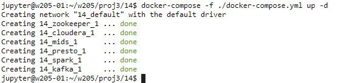

```python
---
version: '2'
services:
  zookeeper:
    image: confluentinc/cp-zookeeper:latest
    environment:
      ZOOKEEPER_CLIENT_PORT: 32181
      ZOOKEEPER_TICK_TIME: 2000
    expose:
      - "2181"
      - "2888"
      - "32181"
      - "3888"
    extra_hosts:
      - "moby:127.0.0.1"

  kafka:
    image: confluentinc/cp-kafka:latest
    depends_on:
      - zookeeper
    environment:
      KAFKA_BROKER_ID: 1
      KAFKA_ZOOKEEPER_CONNECT: zookeeper:32181
      KAFKA_ADVERTISED_LISTENERS: PLAINTEXT://kafka:29092
      KAFKA_OFFSETS_TOPIC_REPLICATION_FACTOR: 1
    expose:
      - "9092"
      - "29092"
    extra_hosts:
      - "moby:127.0.0.1"

  cloudera:
    image: midsw205/hadoop:0.0.2
    hostname: cloudera
    expose:
      - "8020" # nn
      - "8888" # hue
      - "9083" # hive thrift
      - "10000" # hive jdbc
      - "50070" # nn http
    ports:
      - "8888:8888"
    extra_hosts:
      - "moby:127.0.0.1"

  spark:
    image: midsw205/spark-python:0.0.6
    stdin_open: true
    tty: true
    volumes:
      - ~/w205:/w205
    expose:
      - "8888"
    ports:
      - "8889:8888" # 8888 conflicts with hue
    depends_on:
      - cloudera
    environment:
      HADOOP_NAMENODE: cloudera
      HIVE_THRIFTSERVER: cloudera:9083
    extra_hosts:
      - "moby:127.0.0.1"
    command: bash

  presto:
    image: midsw205/presto:0.0.1
    hostname: presto
    volumes:
      - ~/w205:/w205
    expose:
      - "8080"
    environment:
      HIVE_THRIFTSERVER: cloudera:9083
    extra_hosts:
      - "moby:127.0.0.1"

  mids:
    image: midsw205/base:0.1.9
    stdin_open: true
    tty: true
    volumes:
      - ~/w205:/w205
    expose:
      - "5000"
    ports:
      - "5000:5000"
    extra_hosts:
      - "moby:127.0.0.1"
```

We create a **kafka topic** named **_starfighter_** with one partition and one replica.    
We check if **zookeeper** is up and connected to port **32181** on the localhost.    
A kafka topic is essentially a named stream, category or feed of records.    
**Kafka** stores the records in logs. A log in **kafka** is normally broken up into several partitions.    
It normally spreads those partitions across multiple servers and/or disks.    
However in this case we only need one partition.    
Similarly we do not need fault tolerance for this activity, so we set a replication factor of 1.    
The **kafka topic** is initialised with the following script.

```bash
#!/bin/bash
# Proper header for the kafka bash shell script.

docker-compose exec kafka \
  kafka-topics \
    --create \
    --topic starfighter \
    --partitions 1 \
    --replication-factor 1 \
    --if-not-exists \
    --zookeeper zookeeper:32181  
```

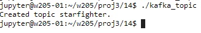

At this point we must spin-up the script that intializes the **flask**.  This is a python script that defines the Applicaion Programming Interface for the server, helping the game to function, by routing the requests to the web pages appropriately.  This process is streaming and stays 'alive' until cancelled with a **_Ctrl-C_** user interrruption.  The process could obviously be backgrounded as well.  The script is detailed below.

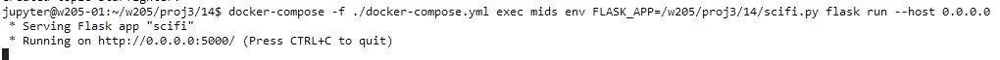

```bash
docker-compose -f ./docker-compose.yml exec mids env FLASK_APP=/w205/proj3/14/scifi.py  flask run --host 0.0.0.0
```

```python
#!/usr/bin/env python
import json
from kafka import KafkaProducer
from flask import Flask, request

app = Flask(__name__)
producer = KafkaProducer(bootstrap_servers='kafka:29092')

def log_to_kafka(topic, event):
    event.update(request.headers)
    producer.send(topic, json.dumps(event).encode())

@app.route("/")
def default_response():
    default_event = {'event_type': 'default'}
    log_to_kafka('starfighter', default_event)
    return "This is the default response!\n"

@app.route("/Enrol_pilot")
def enrol_pilot():
    starfighter_data = request.get_json()
    pilotID    = starfighter_data['pilotID']
    pilot      = starfighter_data['pilot']
    ship       = starfighter_data['ship']
    allegiance = starfighter_data['allegiance']
    ship_cost  = starfighter_data['ship_cost']
    datestamp  = starfighter_data['datestamp']
    enrol_pilot_event = {'event_type': 'USER_data',
                         'pilotID' : pilotID, 
                         'pilot' : pilot, 
                         'ship' : ship,
                         'allegiance' : allegiance, 
                         'ship_cost' : ship_cost, 
                         'datestamp' : datestamp }
    log_to_kafka('starfighter', enrol_pilot_event)
    return ("%s you are successfully enrolled pilot in the %s. Now go clear the starways of your enemies!\n" % (pilot , allegiance))

@app.route("/Fit_ship")
def fit_ship():
    fitting_data = request.get_json()
    pilotID    = fitting_data['pilotID']
    pilot      = fitting_data['pilot']
    missile_launchers = fitting_data['missile_launchers']
    cannons    = fitting_data['cannons']
    missiles   = fitting_data['missiles']
    torpedoes  = fitting_data['torpedoes']
    fit_ship_event = {'event_type': 'USER_fit',
                      'pilotID' : pilotID, 
                      'pilot' : pilot, 
                      'missile_launchers' : missile_launchers, 
                      'cannons' : cannons,
                      'missiles' : missiles,
                      'torpedoes': torpedoes } 
    log_to_kafka('starfighter', fit_ship_event)
    return ("%s you have successfully reconfigured your ship with upgraded weapons.  Slip dry-dock and fight your ship!\n"%pilot)
    
 ```

Now we have to spin-up **kafka** to accept messages into the queue.  This session will be live and is not run in batch mode.  The **_starfighter_** topic is clearly detailed in the command.  The queue is read from the beginning and is not terminated with an end statement (-e). The daemon waits for input from any of the input message methods we discussed previously.

```bash
docker-compose -f ./docker-compose.yml exec mids kafkacat -C -b kafka:29092 -t starfighter -o beginning
```

The messages to enrol pilot are then sent to the queue, either by individual pilots creating accounts, logging-on to existing accounts OR we can force a **JSON** blob of the entire pilot database into the pipelin.  These are sent through via a python command line interface **python** script.

When messages are sent to port 5000 on the localhost we see we a reaction to the touch from the flask like so:

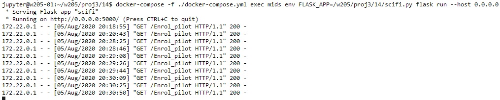

Additionally we see this information being processed by the combination of **kafka** and **kafkacat**.

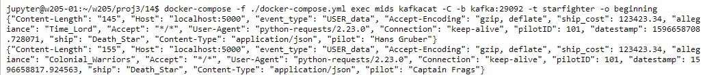

We need to execute **spark** within our specific docker container.  This will stream process the information from the **kafka** queue and store it in **parquet** formatted binary files in the **cloudera hadoop** storage.  In this instance the _/tmp/pilot_enrolments_ and _/tmp/checkpoints_for_pilot_enrolments_ folders.  The schema for the data has to be specifically detailed so that the data is read and stored correctly.  This can be inspected in the **python** script for the **flask** detailed below.

```bash
docker-compose -f ./docker-compose.yml exec spark spark-submit /w205/proj3/14/scifi_write_stream.py
```

```python
#!/usr/bin/env python
import json
from kafka import KafkaProducer
from flask import Flask, request

app = Flask(__name__)
producer = KafkaProducer(bootstrap_servers='kafka:29092')

def log_to_kafka(topic, event):
    event.update(request.headers)
    producer.send(topic, json.dumps(event).encode())

@app.route("/")
def default_response():
    default_event = {'event_type': 'default'}
    log_to_kafka('starfighter', default_event)
    return "This is the default response!\n"

@app.route("/Enrol_pilot")
def enrol_pilot():
    starfighter_data = request.get_json()
    pilotID    = starfighter_data['pilotID']
    pilot      = starfighter_data['pilot']
    ship       = starfighter_data['ship']
    allegiance = starfighter_data['allegiance']
    ship_cost  = starfighter_data['ship_cost']
    datestamp  = starfighter_data['datestamp']
    enrol_pilot_event = {'event_type': 'USER_data',
                         'pilotID' : pilotID, 
                         'pilot' : pilot, 
                         'ship' : ship,
                         'allegiance' : allegiance, 
                         'ship_cost' : ship_cost, 
                         'datestamp' : datestamp }
    log_to_kafka('starfighter', enrol_pilot_event)
    return ("%s you are successfully enrolled pilot in the %s. Now go clear the starways of your enemies!\n" % (pilot , allegiance))

@app.route("/Fit_ship")
def fit_ship():
    fitting_data = request.get_json()
    pilotID    = fitting_data['pilotID']
    pilot      = fitting_data['pilot']
    missile_launchers = fitting_data['missile_launchers']
    cannons    = fitting_data['cannons']
    missiles   = fitting_data['missiles']
    torpedoes  = fitting_data['torpedoes']
    fit_ship_event = {'event_type': 'USER_fit',
                      'pilotID' : pilotID, 
                      'pilot' : pilot, 
                      'missile_launchers' : missile_launchers, 
                      'cannons' : cannons,
                      'missiles' : missiles,
                      'torpedoes': torpedoes } 
    log_to_kafka('starfighter', fit_ship_event)
    return ("%s you have successfully reconfigured your ship with upgraded weapons.  Slip dry-dock and fight your ship!\n"%pilot)
```

The data coming from the streamed read from **kafka** to **spark** for processing and **cloudera hadoop** storage can be checked with the following **docker-compose** command.  It is clear that the folders requested have been created.  Additionally the **snappy** compressed **parquet** files are also seen with different timestamps demonstrating that data is being added, new pilots are being added to the game on a sixty second delay, and their information is being sent to the database for storage and query at a later time.

```bash
docker-compose -f ./docker-compose.yml exec cloudera hadoop fs -ls /tmp/pilot_enrolments
```

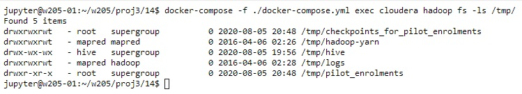

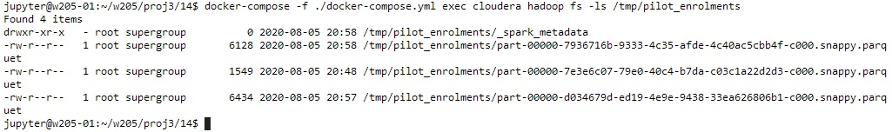

At this point we can access the data and create tables for it using **hive**.  This creates an additional directory called _/tmp/enrolments/_.  This diretory contains more parquet data that can be processed by **presto** for convenient querying purposes.  This is performed with the following script.  This is a batch process.

```bash
docker-compose -f ./docker-compose.yml exec spark spark-submit /w205/proj3/14/scifi_write_hive.py
```

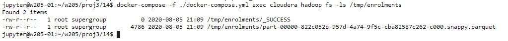

```python
#!/usr/bin/env python
"""Extract events from kafka and write them to hdfs
"""
import json
from pyspark.sql import SparkSession, Row
from pyspark.sql.functions import udf


@udf('boolean')
def is_enrolment(event_as_json):
    event = json.loads(event_as_json)
    if event['event_type'] == 'USER_data':
        return True
    return False


def main():
    """main
    """
    spark = SparkSession \
        .builder \
        .appName("ExtractEventsJob") \
        .enableHiveSupport() \
        .getOrCreate()

    raw_events = spark \
        .read \
        .format("kafka") \
        .option("kafka.bootstrap.servers", "kafka:29092") \
        .option("subscribe", "starfighter") \
        .option("startingOffsets", "earliest") \
        .option("endingOffsets", "latest") \
        .load()

    enrolment_events = raw_events \
        .select(raw_events.value.cast('string').alias('raw'),
                raw_events.timestamp.cast('string')) \
        .filter(is_enrolment('raw'))

    extracted_enrolment_events = enrolment_events \
        .rdd \
        .map(lambda r: Row(timestamp=r.timestamp, **json.loads(r.raw))) \
        .toDF()
    extracted_enrolment_events.printSchema()
    extracted_enrolment_events.show()

    extracted_enrolment_events.registerTempTable("extracted_enrolment_events")

    spark.sql("""
        create external table enrolment
        stored as parquet
        location '/tmp/enrolments'
        as
        select * from extracted_enrolment_events
    """)


if __name__ == "__main__":
    main()
```

We now use **presto** to examine the contents of our database.  We access **presto** with the following commands and can demonstrate that the _enrolment_ table has indeed been created, that it is available for query and contains all the data that we constructed and sent to it via the pipeline.  The **presto: default> show tables;** command and **presto default> describe enrolment;** demonstrate the existence of the **hive** constructed table and its structure.

```python
docker-compose -f ./docker-compose.yml exec presto presto --server presto:8080 --catalog hive --schema default
```

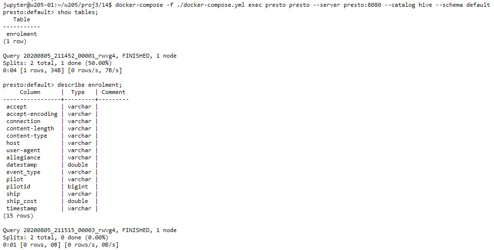

By way of example we perform our first query on the table in **presto** using **SQL** to find the pilots who have enrolled in the game, which alliances they have joined and which ships they have chosen.

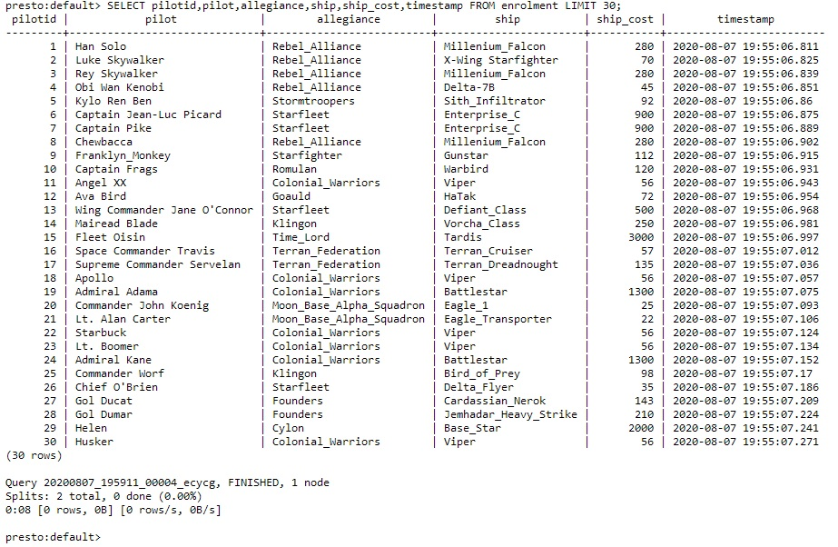

In our second query on our **hive** generated table data, in **presto**  we use **SQL** queries to find out which is the most popular ship with the players of the game.  It is clear that the pilots have select the **Viper**, made famous by the television series **Battle Star Galactica**.  Second is the **Millenium Falcon**, the beloved of **Star Wars** fans.  The **Jedi** ship the **Delta-7B** comes in third most popular.

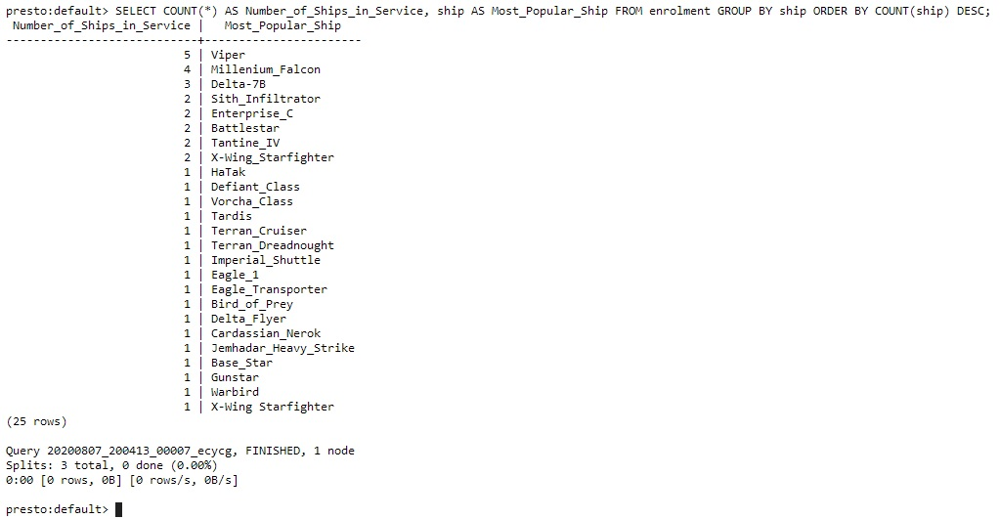

Our third question on our hive generated data in presto is to **SQL** query and find out which is the most popular group that pilots wish to join?    
It is clear from the table that joining the **Rebel Alliance** is the favourite amongst the players of the game.  The **Colonial Warriors** from **Battle Star Galactica** again are very popular, as are the **Star Trek** followers coming in third position.

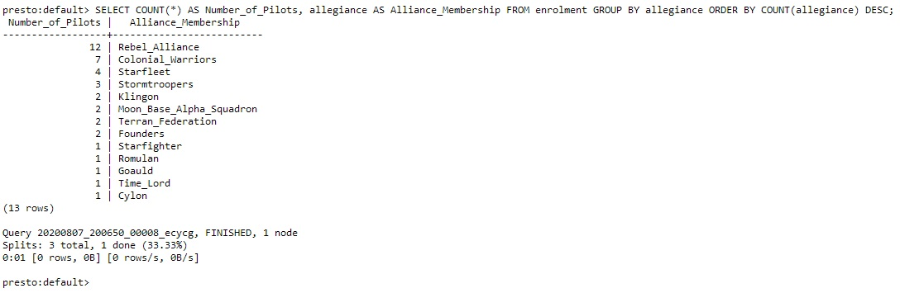

In our last question, we SQL query to find out which are the most expensive ships in the game, priced in **Imperial Credits**?        
Not surprisingly the most expensive ship in the game is the famous **Tardis** or _**Time And Relative Dimension In Space**_ ship, which belongs to **The Doctor**, from the **Dr. Who** series, made famous on United Kingdom television screens.  This ship being able to travel in time brings it a bit of an edge over any other ship it encounters, hence the cost...

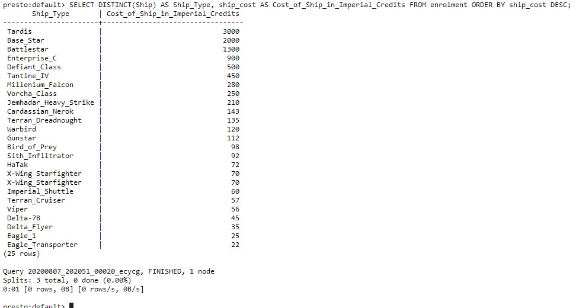

## Business Intelligence gained from our Data Pipeline and Data Science Queries ##

For an online game the information we have gathered could provide excellent business intelligence and information upon which to make decisions regarding future game dynamics, sofware development and business resource allocation.    

1. For an online game the information we have gathered could provide excellent business intelligence and information upon which to make decisions regarding game focus and development spend.    
2. Firstly it's clear the pilots like the **Battle Star Galactica**, **Star Wars** and **Star Trek** alliances and ships.  Keeping players involved and engaged in the game continuously is crucial.  Therefore development spend should be allocated so that new ships, items, modules for these alliances are provided as part of software upgrades.  If the game is subscription based then this will influence players to stay in the game.  The hook being gratifying their wishes by catering to their tastes with new and additional feature extensions.     
3. Underutilised alliances and ship types could be improved so that they provide additional functionality or a new 'edge' so that they become increasingly powerful.  This will help balance the game and encourage both new and old players to explore areas and aspects of the gameplay they have not engaged with previously.  Groupings such as **Cylons**, **Time Lords** and **Romulan** alliances fall into these categories, being under-subscribed groups.    
   Since the **Battle Star Galactica** and **Star Wars** blocks are large compared to the other groups, it may be advantageous to the gameplay to enforce a war between those groups, so that they cannot align and destroy balance in the game by creating an enormous "power" block.  This could be called a **Faction War**, which pilots could subscribe to, or continue to fly solo.    
4. If the **Viper** and **Millenium Falcon** ship are "overly" powerful then their abilities as ships could be restricted to balance the field for other ship types.  This approach is called **nerfing** and is endemic in online games of this type.    


# FIN #

With the activity completed we now bring our docker cluster and associated containers down with the following command.

```bash
docker-compose -f ./docker-compose.yml down
```
